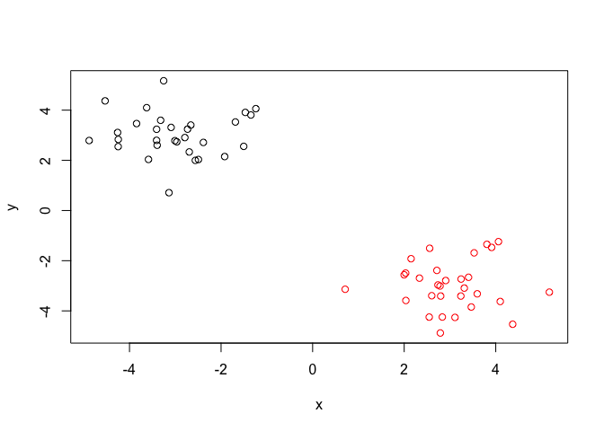
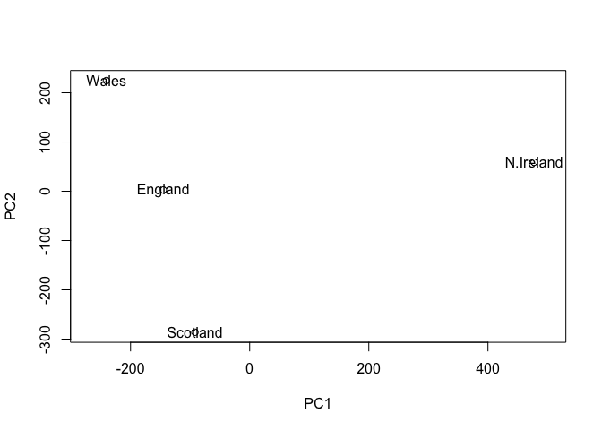

Class 8 Machine Learning
================
Reina Bassil
10/25/2019

## K-means example

We will make up some data to cluster

``` r
# Generate some example data for clustering
tmp <- c(rnorm(30,-3), rnorm(30,3))
x <- cbind(x=tmp, y=rev(tmp))

plot(x)
```

<!-- -->

Use the kmeans() function setting k to 2 and nstart=20

``` r
k <- kmeans(x, centers = 2, nstart = 20)
```

Inspect/print the results

``` r
k
```

    ## K-means clustering with 2 clusters of sizes 30, 30
    ## 
    ## Cluster means:
    ##           x         y
    ## 1  3.027975 -2.990296
    ## 2 -2.990296  3.027975
    ## 
    ## Clustering vector:
    ##  [1] 2 2 2 2 2 2 2 2 2 2 2 2 2 2 2 2 2 2 2 2 2 2 2 2 2 2 2 2 2 2 1 1 1 1 1
    ## [36] 1 1 1 1 1 1 1 1 1 1 1 1 1 1 1 1 1 1 1 1 1 1 1 1 1
    ## 
    ## Within cluster sum of squares by cluster:
    ## [1] 48.9154 48.9154
    ##  (between_SS / total_SS =  91.7 %)
    ## 
    ## Available components:
    ## 
    ## [1] "cluster"      "centers"      "totss"        "withinss"    
    ## [5] "tot.withinss" "betweenss"    "size"         "iter"        
    ## [9] "ifault"

Q. How many points are in each cluster?

``` r
k$size
```

    ## [1] 30 30

Q. What ‘component’ of your result object details - cluster size? -
cluster assignment/membership? - cluster center?

Plot x colored by the kmeans cluster assignment and add cluster centers
as blue points

``` r
table(k$cluster)
```

    ## 
    ##  1  2 
    ## 30 30

``` r
plot(x, col= k$cluster)
points(k$centers, col = "blue", pch = 15)
```

<!-- -->

## Hierarchical clustering in R

``` r
hc <- hclust( dist(x))
hc
```

    ## 
    ## Call:
    ## hclust(d = dist(x))
    ## 
    ## Cluster method   : complete 
    ## Distance         : euclidean 
    ## Number of objects: 60

Plot my results

``` r
plot(hc)
abline(h=6, col="red")
abline(h=4, col="blue")
```

<!-- -->

``` r
#h is height, not that same as k 
cutree(hc, h=6)
```

    ##  [1] 1 1 1 1 1 1 1 1 1 1 1 1 1 1 1 1 1 1 1 1 1 1 1 1 1 1 1 1 1 1 2 2 2 2 2
    ## [36] 2 2 2 2 2 2 2 2 2 2 2 2 2 2 2 2 2 2 2 2 2 2 2 2 2

``` r
grps <- cutree(hc, h=4)
table(grps)
```

    ## grps
    ##  1  2  3  4 
    ## 19 11 11 19

I can also cut the tree to yield a given “k”
    groups/clusters

``` r
cutree(hc, k=2)
```

    ##  [1] 1 1 1 1 1 1 1 1 1 1 1 1 1 1 1 1 1 1 1 1 1 1 1 1 1 1 1 1 1 1 2 2 2 2 2
    ## [36] 2 2 2 2 2 2 2 2 2 2 2 2 2 2 2 2 2 2 2 2 2 2 2 2 2

``` r
cutree(hc, k=4)
```

    ##  [1] 1 1 1 2 1 1 1 1 1 1 1 2 1 1 1 1 2 1 1 2 2 2 2 1 1 1 2 2 2 2 3 3 3 3 4
    ## [36] 4 4 3 3 3 3 4 4 3 4 4 4 4 3 4 4 4 4 4 4 4 3 4 4 4

``` r
grps <- cutree(hc, k=2)

plot(x, col=grps)
```

<!-- -->

``` r
# Step 1. Generate some example data for clustering
x <- rbind(
 matrix(rnorm(100, mean=0, sd = 0.3), ncol = 2), # c1
 matrix(rnorm(100, mean = 1, sd = 0.3), ncol = 2), # c2
 matrix(c(rnorm(50, mean = 1, sd = 0.3), # c3
 rnorm(50, mean = 0, sd = 0.3)), ncol = 2))
colnames(x) <- c("x", "y")
```

``` r
# Step 2. Plot the data without clustering
plot(x)
```

<!-- -->

``` r
# Step 3. Generate colors for known clusters
# (just so we can compare to hclust results)
col <- as.factor( rep(c("c1","c2","c3"), each=50) )
plot(x, col=col)
```

<!-- -->

``` r
ex <- hclust( dist(x))
plot(ex)
```

<!-- -->

``` r
grps2 <- cutree(ex,k=2)

grps3 <- cutree(ex, k=3)

plot(x, col=grps2)
```

<!-- -->

``` r
plot(x, col=grps3)
```

<!-- -->

``` r
plot(x, col=col)
```

<!-- -->

``` r
table(col, grps3)
```

    ##     grps3
    ## col   1  2  3
    ##   c1 46  4  0
    ##   c2  3  0 47
    ##   c3  1 39 10

## Principle Component Analysis

How to use the prcomp() function to do PCA. • How to draw and interpret
PCA plots • How to determine how much variation each principal component
accounts for and the the “intrinsic dimensionality” useful for further
analysis • How to examine the loadings (or loading scores) to determine
what variables have the largest effect on the graph and are thus
important for discriminating samples.

``` r
mydata <- read.csv("https://tinyurl.com/expression-CSV",
 row.names=1)
head(mydata)
```

    ##        wt1 wt2  wt3  wt4 wt5 ko1 ko2 ko3 ko4 ko5
    ## gene1  439 458  408  429 420  90  88  86  90  93
    ## gene2  219 200  204  210 187 427 423 434 433 426
    ## gene3 1006 989 1030 1017 973 252 237 238 226 210
    ## gene4  783 792  829  856 760 849 856 835 885 894
    ## gene5  181 249  204  244 225 277 305 272 270 279
    ## gene6  460 502  491  491 493 612 594 577 618 638

``` r
mydata2 <- read.csv("https://tinyurl.com/expression-CSV")
head(mydata2)
```

    ##       X  wt1 wt2  wt3  wt4 wt5 ko1 ko2 ko3 ko4 ko5
    ## 1 gene1  439 458  408  429 420  90  88  86  90  93
    ## 2 gene2  219 200  204  210 187 427 423 434 433 426
    ## 3 gene3 1006 989 1030 1017 973 252 237 238 226 210
    ## 4 gene4  783 792  829  856 760 849 856 835 885 894
    ## 5 gene5  181 249  204  244 225 277 305 272 270 279
    ## 6 gene6  460 502  491  491 493 612 594 577 618 638

Now we have our data we call prcomp() to do PCA • NOTE: prcomp() expects
the samples to be rows and genes to be columns so we need to first
transpose the matrix with the t() function\!

``` r
pca <- prcomp(t(mydata), scale=TRUE) 

## See what is returnedby the prcomp() function
attributes(pca)
```

    ## $names
    ## [1] "sdev"     "rotation" "center"   "scale"    "x"       
    ## 
    ## $class
    ## [1] "prcomp"

``` r
pca$x[,1]
```

    ##       wt1       wt2       wt3       wt4       wt5       ko1       ko2 
    ## -9.697374 -9.138950 -9.054263 -8.731483 -9.006312  8.846999  9.213885 
    ##       ko3       ko4       ko5 
    ##  9.458412  8.883412  9.225673

Plot PCA1
vs. PCA2

``` r
plot(pca$x[,1], pca$x[,2])
```

<!-- -->

``` r
summary(pca)
```

    ## Importance of components:
    ##                           PC1    PC2     PC3     PC4     PC5     PC6
    ## Standard deviation     9.6237 1.5198 1.05787 1.05203 0.88062 0.82545
    ## Proportion of Variance 0.9262 0.0231 0.01119 0.01107 0.00775 0.00681
    ## Cumulative Proportion  0.9262 0.9493 0.96045 0.97152 0.97928 0.98609
    ##                            PC7     PC8     PC9      PC10
    ## Standard deviation     0.80111 0.62065 0.60342 3.348e-15
    ## Proportion of Variance 0.00642 0.00385 0.00364 0.000e+00
    ## Cumulative Proportion  0.99251 0.99636 1.00000 1.000e+00

Scree Plotting

``` r
pca.var <- pca$sdev^2
pca.var.per <- round(pca.var/sum(pca.var)*100, 1)

barplot(pca.var.per, main="Scree Plot",
 xlab="Principal Component", ylab="Percent Variation")
```

<!-- -->

Can also just plot PCA and it does the calculation for you, but it’s
important to know where the calculation comes from - square of the
standard
deviation

``` r
plot(pca)
```

<!-- -->

``` r
plot(pca$x[,1:2], col= c())
```

<!-- -->

``` r
rep("red", 5)
```

    ## [1] "red" "red" "red" "red" "red"

``` r
rep("blue", 5)
```

    ## [1] "blue" "blue" "blue" "blue" "blue"

## Practice

``` r
x <- read.csv("UK_foods.csv")
```

Q1. How many rows and columns are in your new data frame named x? What R
functions could you use to answer this questions?

``` r
dim(x)
```

    ## [1] 17  5

Checking your data

``` r
head(x)
```

    ##                X England Wales Scotland N.Ireland
    ## 1         Cheese     105   103      103        66
    ## 2  Carcass_meat      245   227      242       267
    ## 3    Other_meat      685   803      750       586
    ## 4           Fish     147   160      122        93
    ## 5 Fats_and_oils      193   235      184       209
    ## 6         Sugars     156   175      147       139

Hmm, it looks like the row-names here were not set properly as we were
expecting 4 columns (one for each of the 4 countries of the UK - not 5
as reported from the dim() function).

Here it appears that the row-names are incorrectly set as the first
column of our x data frame (rather than set as proper row-names). This
is very common error. Lets try to fix this up with the following code,
which sets the rownames() to the first column and then removes the
troublesome first column (with the -1 column index):

``` r
rownames(x) <- x[,1]
x <- x[,-1]
head(x)
```

    ##                England Wales Scotland N.Ireland
    ## Cheese             105   103      103        66
    ## Carcass_meat       245   227      242       267
    ## Other_meat         685   803      750       586
    ## Fish               147   160      122        93
    ## Fats_and_oils      193   235      184       209
    ## Sugars             156   175      147       139

Check new dimensions

``` r
dim(x)
```

    ## [1] 17  4

Side-note: An alternative approach to setting the correct row-names in
this case would be to read the data filie again and this time set the
row.names argument of read.csv() to be the first column (i.e. use
argument setting row.names=1), see below:

``` r
x <- read.csv("UK_foods.csv", row.names=1)
head(x)
```

    ##                England Wales Scotland N.Ireland
    ## Cheese             105   103      103        66
    ## Carcass_meat       245   227      242       267
    ## Other_meat         685   803      750       586
    ## Fish               147   160      122        93
    ## Fats_and_oils      193   235      184       209
    ## Sugars             156   175      147       139

``` r
barplot(as.matrix(x), beside=T, col=rainbow(nrow(x)))
```

<!-- -->

Q3: Changing what optional argument in the above barplot() function
results in the following
plot?

``` r
barplot(as.matrix(x), beside=F, col=rainbow(nrow(x)))
```

<!-- -->

Q5: Generating all pairwise plots may help somewhat. Can you make sense
of the following code and resulting figure? What does it mean if a given
point lies on the diagonal for a given
plot?

``` r
pairs(x, col=rainbow(10), pch=16)
```

<!-- -->

As we noted in the lecture portion of class, prcomp() expects the
observations to be rows and the variables to be columns therefore we
need to first transpose our data.frame matrix with the t() transpose
function.

``` r
pca <- prcomp( t(x) )
summary(pca)
```

    ## Importance of components:
    ##                             PC1      PC2      PC3       PC4
    ## Standard deviation     324.1502 212.7478 73.87622 4.189e-14
    ## Proportion of Variance   0.6744   0.2905  0.03503 0.000e+00
    ## Cumulative Proportion    0.6744   0.9650  1.00000 1.000e+00

Q7. Complete the code below to generate a plot of PC1 vs PC2. The second
line adds text labels over the data points.

``` r
plot(pca$x[,1], pca$x[,2], xlab="PC1", ylab="PC2", xlim=c(-270,500))
text(pca$x[,1], pca$x[,2], colnames(x))
```

<!-- -->

Q8. Customize your plot so that the colors of the country names match
the colors in our UK and Ireland map and table at start of this
document.

## Digging deeper (variable loadings)

``` r
## Lets focus on PC1 as it accounts for > 90% of variance 
par(mar=c(10, 3, 0.35, 0))
barplot( pca$rotation[,1], las=2 )
```

<!-- -->
