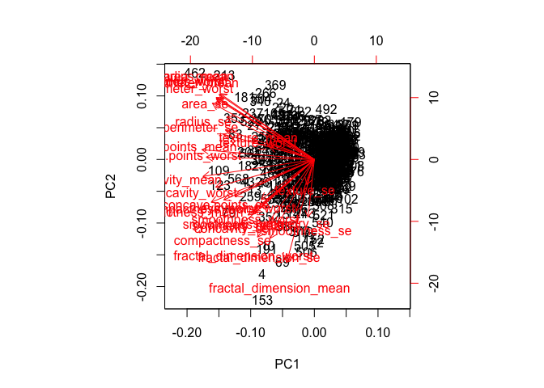
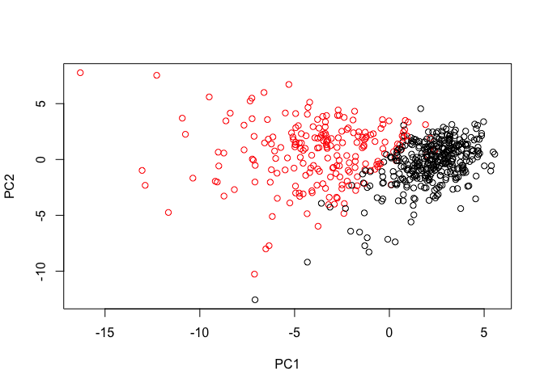
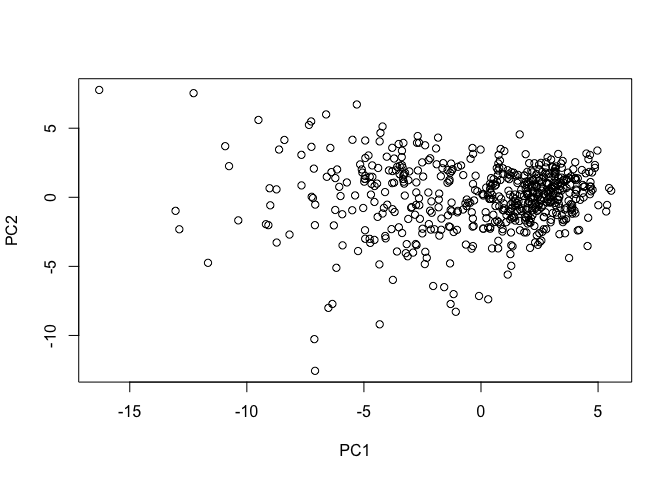
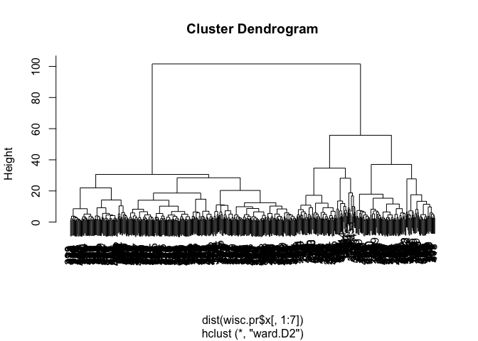
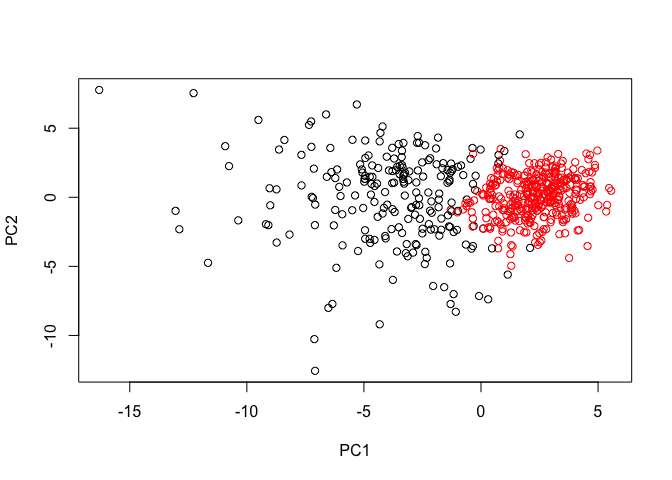

Class 9 Mini Learning Project
================
Reina Bassil
10/30/2019

``` r
wisc.df <- read.csv("WisconsinCancer.csv", header = TRUE)
```

``` r
head(wisc.df)
```

    ##         id diagnosis radius_mean texture_mean perimeter_mean area_mean
    ## 1   842302         M       17.99        10.38         122.80    1001.0
    ## 2   842517         M       20.57        17.77         132.90    1326.0
    ## 3 84300903         M       19.69        21.25         130.00    1203.0
    ## 4 84348301         M       11.42        20.38          77.58     386.1
    ## 5 84358402         M       20.29        14.34         135.10    1297.0
    ## 6   843786         M       12.45        15.70          82.57     477.1
    ##   smoothness_mean compactness_mean concavity_mean concave.points_mean
    ## 1         0.11840          0.27760         0.3001             0.14710
    ## 2         0.08474          0.07864         0.0869             0.07017
    ## 3         0.10960          0.15990         0.1974             0.12790
    ## 4         0.14250          0.28390         0.2414             0.10520
    ## 5         0.10030          0.13280         0.1980             0.10430
    ## 6         0.12780          0.17000         0.1578             0.08089
    ##   symmetry_mean fractal_dimension_mean radius_se texture_se perimeter_se
    ## 1        0.2419                0.07871    1.0950     0.9053        8.589
    ## 2        0.1812                0.05667    0.5435     0.7339        3.398
    ## 3        0.2069                0.05999    0.7456     0.7869        4.585
    ## 4        0.2597                0.09744    0.4956     1.1560        3.445
    ## 5        0.1809                0.05883    0.7572     0.7813        5.438
    ## 6        0.2087                0.07613    0.3345     0.8902        2.217
    ##   area_se smoothness_se compactness_se concavity_se concave.points_se
    ## 1  153.40      0.006399        0.04904      0.05373           0.01587
    ## 2   74.08      0.005225        0.01308      0.01860           0.01340
    ## 3   94.03      0.006150        0.04006      0.03832           0.02058
    ## 4   27.23      0.009110        0.07458      0.05661           0.01867
    ## 5   94.44      0.011490        0.02461      0.05688           0.01885
    ## 6   27.19      0.007510        0.03345      0.03672           0.01137
    ##   symmetry_se fractal_dimension_se radius_worst texture_worst
    ## 1     0.03003             0.006193        25.38         17.33
    ## 2     0.01389             0.003532        24.99         23.41
    ## 3     0.02250             0.004571        23.57         25.53
    ## 4     0.05963             0.009208        14.91         26.50
    ## 5     0.01756             0.005115        22.54         16.67
    ## 6     0.02165             0.005082        15.47         23.75
    ##   perimeter_worst area_worst smoothness_worst compactness_worst
    ## 1          184.60     2019.0           0.1622            0.6656
    ## 2          158.80     1956.0           0.1238            0.1866
    ## 3          152.50     1709.0           0.1444            0.4245
    ## 4           98.87      567.7           0.2098            0.8663
    ## 5          152.20     1575.0           0.1374            0.2050
    ## 6          103.40      741.6           0.1791            0.5249
    ##   concavity_worst concave.points_worst symmetry_worst
    ## 1          0.7119               0.2654         0.4601
    ## 2          0.2416               0.1860         0.2750
    ## 3          0.4504               0.2430         0.3613
    ## 4          0.6869               0.2575         0.6638
    ## 5          0.4000               0.1625         0.2364
    ## 6          0.5355               0.1741         0.3985
    ##   fractal_dimension_worst  X
    ## 1                 0.11890 NA
    ## 2                 0.08902 NA
    ## 3                 0.08758 NA
    ## 4                 0.17300 NA
    ## 5                 0.07678 NA
    ## 6                 0.12440 NA

Q1.. What type of object is returned from the read.csv() function?

``` r
class(wisc.df)
```

    ## [1] "data.frame"

Data frame

Q2. How many observations (i.e. patients) are in this dataset? Here we
examine data for 569 patient samples.

``` r
nrow(wisc.df)
```

    ## [1] 569

569 patients

Q3. How many of the observations have a malignant diagnosis?

``` r
cancerous <- table(wisc.df$diagnosis)
cancerous
```

    ## 
    ##   B   M 
    ## 357 212

In this data set we have 357 non cancer and 212 cancer diagnoses.

In this data set we have 357 non cancer and 212 cancer diagnoses.

Q4. How many variables/features in the data are suffixed with \_mean?

``` r
colnames(wisc.df)
```

    ##  [1] "id"                      "diagnosis"              
    ##  [3] "radius_mean"             "texture_mean"           
    ##  [5] "perimeter_mean"          "area_mean"              
    ##  [7] "smoothness_mean"         "compactness_mean"       
    ##  [9] "concavity_mean"          "concave.points_mean"    
    ## [11] "symmetry_mean"           "fractal_dimension_mean" 
    ## [13] "radius_se"               "texture_se"             
    ## [15] "perimeter_se"            "area_se"                
    ## [17] "smoothness_se"           "compactness_se"         
    ## [19] "concavity_se"            "concave.points_se"      
    ## [21] "symmetry_se"             "fractal_dimension_se"   
    ## [23] "radius_worst"            "texture_worst"          
    ## [25] "perimeter_worst"         "area_worst"             
    ## [27] "smoothness_worst"        "compactness_worst"      
    ## [29] "concavity_worst"         "concave.points_worst"   
    ## [31] "symmetry_worst"          "fractal_dimension_worst"
    ## [33] "X"

``` r
#Could count by hand, or use grep
```

``` r
grep("_mean", colnames(wisc.df))
```

    ##  [1]  3  4  5  6  7  8  9 10 11 12

``` r
y <- length(grep("_mean", colnames(wisc.df)))
```

There are `y` variables in the data suffixed by \_mean.

Q5. Why do you think we are using the indices 3:32 here? We want to keep
the patient IDs and whether the tumors are benign or malignant out of
the data analysis. In addition, there is a final row X that has NA data
that could cause errors.

``` r
wisc.data <- as.matrix( wisc.df[,3:32])
```

The next step in our analysis is to perform principal component analysis
(PCA) on wisc.data.

Do we need to scale the
    data?

``` r
round( apply (wisc.data, 2, sd), 3)
```

    ##             radius_mean            texture_mean          perimeter_mean 
    ##                   3.524                   4.301                  24.299 
    ##               area_mean         smoothness_mean        compactness_mean 
    ##                 351.914                   0.014                   0.053 
    ##          concavity_mean     concave.points_mean           symmetry_mean 
    ##                   0.080                   0.039                   0.027 
    ##  fractal_dimension_mean               radius_se              texture_se 
    ##                   0.007                   0.277                   0.552 
    ##            perimeter_se                 area_se           smoothness_se 
    ##                   2.022                  45.491                   0.003 
    ##          compactness_se            concavity_se       concave.points_se 
    ##                   0.018                   0.030                   0.006 
    ##             symmetry_se    fractal_dimension_se            radius_worst 
    ##                   0.008                   0.003                   4.833 
    ##           texture_worst         perimeter_worst              area_worst 
    ##                   6.146                  33.603                 569.357 
    ##        smoothness_worst       compactness_worst         concavity_worst 
    ##                   0.023                   0.157                   0.209 
    ##    concave.points_worst          symmetry_worst fractal_dimension_worst 
    ##                   0.066                   0.062                   0.018

Looks like we need to use `scale=TRUE` here as our data standard
deviations are very different. If we run unscaled, the area would drive
the whole calculation. Since we are measuring different things with
different columns, we need to scale to make comparisons more fair.

``` r
#Perform PCA on wisc.data by completing the following code
wisc.pr <- prcomp( wisc.data, scale= TRUE)
```

``` r
summary(wisc.pr)
```

    ## Importance of components:
    ##                           PC1    PC2     PC3     PC4     PC5     PC6
    ## Standard deviation     3.6444 2.3857 1.67867 1.40735 1.28403 1.09880
    ## Proportion of Variance 0.4427 0.1897 0.09393 0.06602 0.05496 0.04025
    ## Cumulative Proportion  0.4427 0.6324 0.72636 0.79239 0.84734 0.88759
    ##                            PC7     PC8    PC9    PC10   PC11    PC12
    ## Standard deviation     0.82172 0.69037 0.6457 0.59219 0.5421 0.51104
    ## Proportion of Variance 0.02251 0.01589 0.0139 0.01169 0.0098 0.00871
    ## Cumulative Proportion  0.91010 0.92598 0.9399 0.95157 0.9614 0.97007
    ##                           PC13    PC14    PC15    PC16    PC17    PC18
    ## Standard deviation     0.49128 0.39624 0.30681 0.28260 0.24372 0.22939
    ## Proportion of Variance 0.00805 0.00523 0.00314 0.00266 0.00198 0.00175
    ## Cumulative Proportion  0.97812 0.98335 0.98649 0.98915 0.99113 0.99288
    ##                           PC19    PC20   PC21    PC22    PC23   PC24
    ## Standard deviation     0.22244 0.17652 0.1731 0.16565 0.15602 0.1344
    ## Proportion of Variance 0.00165 0.00104 0.0010 0.00091 0.00081 0.0006
    ## Cumulative Proportion  0.99453 0.99557 0.9966 0.99749 0.99830 0.9989
    ##                           PC25    PC26    PC27    PC28    PC29    PC30
    ## Standard deviation     0.12442 0.09043 0.08307 0.03987 0.02736 0.01153
    ## Proportion of Variance 0.00052 0.00027 0.00023 0.00005 0.00002 0.00000
    ## Cumulative Proportion  0.99942 0.99969 0.99992 0.99997 1.00000 1.00000

``` r
x <- summary(wisc.pr)
x$importance
```

    ##                             PC1      PC2      PC3      PC4      PC5
    ## Standard deviation     3.644394 2.385656 1.678675 1.407352 1.284029
    ## Proportion of Variance 0.442720 0.189710 0.093930 0.066020 0.054960
    ## Cumulative Proportion  0.442720 0.632430 0.726360 0.792390 0.847340
    ##                             PC6       PC7       PC8       PC9      PC10
    ## Standard deviation     1.098798 0.8217178 0.6903746 0.6456739 0.5921938
    ## Proportion of Variance 0.040250 0.0225100 0.0158900 0.0139000 0.0116900
    ## Cumulative Proportion  0.887590 0.9101000 0.9259800 0.9398800 0.9515700
    ##                             PC11      PC12      PC13      PC14      PC15
    ## Standard deviation     0.5421399 0.5110395 0.4912815 0.3962445 0.3068142
    ## Proportion of Variance 0.0098000 0.0087100 0.0080500 0.0052300 0.0031400
    ## Cumulative Proportion  0.9613700 0.9700700 0.9781200 0.9833500 0.9864900
    ##                             PC16      PC17      PC18      PC19      PC20
    ## Standard deviation     0.2826001 0.2437192 0.2293878 0.2224356 0.1765203
    ## Proportion of Variance 0.0026600 0.0019800 0.0017500 0.0016500 0.0010400
    ## Cumulative Proportion  0.9891500 0.9911300 0.9928800 0.9945300 0.9955700
    ##                             PC21      PC22      PC23      PC24      PC25
    ## Standard deviation     0.1731268 0.1656484 0.1560155 0.1343689 0.1244238
    ## Proportion of Variance 0.0010000 0.0009100 0.0008100 0.0006000 0.0005200
    ## Cumulative Proportion  0.9965700 0.9974900 0.9983000 0.9989000 0.9994200
    ##                             PC26       PC27      PC28       PC29
    ## Standard deviation     0.0904303 0.08306903 0.0398665 0.02736427
    ## Proportion of Variance 0.0002700 0.00023000 0.0000500 0.00002000
    ## Cumulative Proportion  0.9996900 0.99992000 0.9999700 1.00000000
    ##                              PC30
    ## Standard deviation     0.01153451
    ## Proportion of Variance 0.00000000
    ## Cumulative Proportion  1.00000000

``` r
x$importance[,"PC1"]
```

    ##     Standard deviation Proportion of Variance  Cumulative Proportion 
    ##               3.644394               0.442720               0.442720

Q7. From your results, what proportion of the original variance is
captured by the first principal components (PC1)? The first PC captures
44.272% of the original variance in the dataset.

``` r
x$importance[2,"PC1"]*100
```

    ## [1] 44.272

Q8. How many principal components (PCs) are required to describe at
least 70% of the original variance in the data? 3 PCs are required to
describe at least 70% of the original variance in the data.

``` r
which(x$importance[3,] > 0.7)[1]
```

    ## PC3 
    ##   3

Q9. How many principal components (PCs) are required to describe at
least 90% of the original variance in the data? 7 PCs are required to
describe at least 70% of the original variance in the data.

``` r
which(x$importance[3,] > 0.9)[1]
```

    ## PC7 
    ##   7

Plot PC1 vs PC2 and color by
malignant/benign

``` r
biplot(wisc.pr)
```

<!-- -->

Scree
Plot

``` r
plot(wisc.pr)
```

<!-- -->

Make diagnosis
vector

``` r
diagnosis <- wisc.df[,2]
```

``` r
plot(wisc.pr$x[,1:2], col = wisc.df$diagnosis)
```

<!-- -->

``` r
#include [,1] and [,2] for PC1 and PC2. It defaults but if you do other PC then use this. 
plot(wisc.pr$x)
```

<!-- -->

\#\#Hierarchical
clustering

``` r
plot(hclust( dist(wisc.data)))
```

<!-- -->

Use input from our principal component
analysis

``` r
plot(hclust( dist(wisc.pr$x[,1:7]), "ward.D2"))
```

<!-- -->

``` r
wisc.pr.hclust <- hclust( dist(wisc.pr$x[,1:7]), "ward.D2")
```

``` r
grps <- cutree(wisc.pr.hclust, k=2)
table(grps)
```

    ## grps
    ##   1   2 
    ## 216 353

``` r
table(grps, diagnosis)
```

    ##     diagnosis
    ## grps   B   M
    ##    1  28 188
    ##    2 329  24

``` r
plot(wisc.pr$x[,1:2], col=grps)
```

<!-- -->

``` r
url <- "https://tinyurl.com/new-samples-CSV"
new <- read.csv(url)
npc <- predict(wisc.pr, newdata=new)
npc
```

    ##            PC1       PC2        PC3        PC4       PC5        PC6
    ## [1,]  2.576616 -3.135913  1.3990492 -0.7631950  2.781648 -0.8150185
    ## [2,] -4.754928 -3.009033 -0.1660946 -0.6052952 -1.140698 -1.2189945
    ##             PC7        PC8       PC9       PC10      PC11      PC12
    ## [1,] -0.3959098 -0.2307350 0.1029569 -0.9272861 0.3411457  0.375921
    ## [2,]  0.8193031 -0.3307423 0.5281896 -0.4855301 0.7173233 -1.185917
    ##           PC13     PC14      PC15       PC16        PC17        PC18
    ## [1,] 0.1610764 1.187882 0.3216974 -0.1743616 -0.07875393 -0.11207028
    ## [2,] 0.5893856 0.303029 0.1299153  0.1448061 -0.40509706  0.06565549
    ##             PC19       PC20       PC21       PC22       PC23       PC24
    ## [1,] -0.08802955 -0.2495216  0.1228233 0.09358453 0.08347651  0.1223396
    ## [2,]  0.25591230 -0.4289500 -0.1224776 0.01732146 0.06316631 -0.2338618
    ##             PC25         PC26         PC27        PC28         PC29
    ## [1,]  0.02124121  0.078884581  0.220199544 -0.02946023 -0.015620933
    ## [2,] -0.20755948 -0.009833238 -0.001134152  0.09638361  0.002795349
    ##              PC30
    ## [1,]  0.005269029
    ## [2,] -0.019015820
