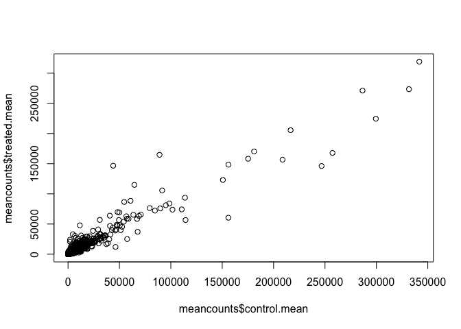
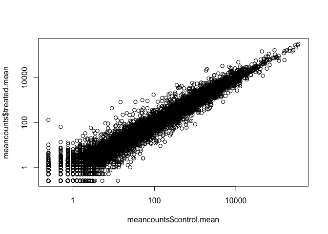
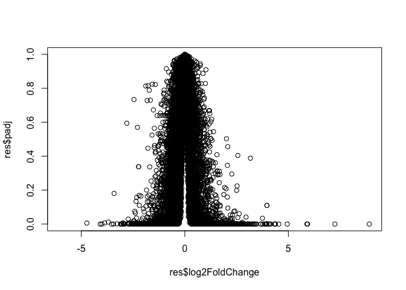
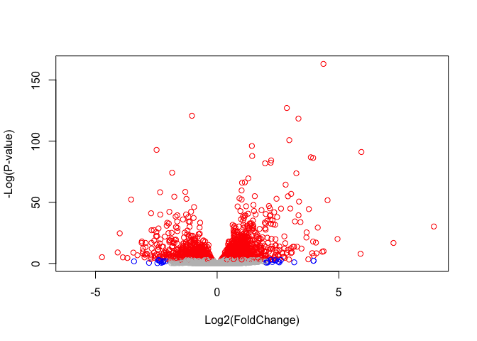

Transcriptomics and the analysis of RNA-Seq data
================

## Transcriptomics and the analysis of RNA-Seq data

Set up Bioconductor DESeq2

``` r
install.packages("BiocManager")
BiocManager::install()
BiocManager::install("DESeq2")
```

Obtain data for today’s class

``` r
counts <- read.csv("airway_scaledcounts.csv", stringsAsFactors = FALSE)
metadata <-  read.csv("airway_metadata.csv", stringsAsFactors = FALSE)
```

Q1. How many genes are in this dataset?
    38694

``` r
head(counts)
```

    ##           ensgene SRR1039508 SRR1039509 SRR1039512 SRR1039513 SRR1039516
    ## 1 ENSG00000000003        723        486        904        445       1170
    ## 2 ENSG00000000005          0          0          0          0          0
    ## 3 ENSG00000000419        467        523        616        371        582
    ## 4 ENSG00000000457        347        258        364        237        318
    ## 5 ENSG00000000460         96         81         73         66        118
    ## 6 ENSG00000000938          0          0          1          0          2
    ##   SRR1039517 SRR1039520 SRR1039521
    ## 1       1097        806        604
    ## 2          0          0          0
    ## 3        781        417        509
    ## 4        447        330        324
    ## 5         94        102         74
    ## 6          0          0          0

``` r
nrow(counts)
```

    ## [1] 38694

How many experiments?

``` r
ncol(counts) - 1
```

    ## [1] 8

Q2. How many ‘control’ cell lines do we have?

``` r
head(metadata)
```

    ##           id     dex celltype     geo_id
    ## 1 SRR1039508 control   N61311 GSM1275862
    ## 2 SRR1039509 treated   N61311 GSM1275863
    ## 3 SRR1039512 control  N052611 GSM1275866
    ## 4 SRR1039513 treated  N052611 GSM1275867
    ## 5 SRR1039516 control  N080611 GSM1275870
    ## 6 SRR1039517 treated  N080611 GSM1275871

``` r
nrow(metadata) /2
```

    ## [1] 4

Lets make sure the metaaata id col matcches rhe colnames of
    counts

``` r
colnames(counts)[-1]
```

    ## [1] "SRR1039508" "SRR1039509" "SRR1039512" "SRR1039513" "SRR1039516"
    ## [6] "SRR1039517" "SRR1039520" "SRR1039521"

``` r
metadata$id
```

    ## [1] "SRR1039508" "SRR1039509" "SRR1039512" "SRR1039513" "SRR1039516"
    ## [6] "SRR1039517" "SRR1039520" "SRR1039521"

``` r
all(colnames(counts)[-1] == metadata$id )
```

    ## [1] TRUE

## Analysis : compare the control to drug treated

First we need to access the columns of our countData that are control
and then find their mean.

``` r
metadata$dex=="control"
```

    ## [1]  TRUE FALSE  TRUE FALSE  TRUE FALSE  TRUE FALSE

``` r
control.id <- metadata [metadata$dex=="control", ]$id
control.id
```

    ## [1] "SRR1039508" "SRR1039512" "SRR1039516" "SRR1039520"

Focus on the counts for control experiments

``` r
head( counts[,control.id] )
```

    ##   SRR1039508 SRR1039512 SRR1039516 SRR1039520
    ## 1        723        904       1170        806
    ## 2          0          0          0          0
    ## 3        467        616        582        417
    ## 4        347        364        318        330
    ## 5         96         73        118        102
    ## 6          0          1          2          0

Mean counts for control experiments

``` r
control.mean <- rowSums(counts[,control.id])/length(control.id)
names(control.mean) <- counts$ensgene
```

Now for the treated columns

``` r
treated.id <- metadata [metadata$dex=="treated", ]$id
treated.id
```

    ## [1] "SRR1039509" "SRR1039513" "SRR1039517" "SRR1039521"

Focus on the counts for the treated experiments

``` r
head( counts[,treated.id])
```

    ##   SRR1039509 SRR1039513 SRR1039517 SRR1039521
    ## 1        486        445       1097        604
    ## 2          0          0          0          0
    ## 3        523        371        781        509
    ## 4        258        237        447        324
    ## 5         81         66         94         74
    ## 6          0          0          0          0

Mean counts for treated experiments

``` r
treated.mean <- rowSums(counts[,treated.id])/length(treated.id)
names(treated.mean) <- counts$ensgene
```

Let’s store these together

``` r
meancounts <- data.frame(control.mean, treated.mean)
```

Plot control vs
treated\!

``` r
plot(meancounts$control.mean, meancounts$treated.mean)
```

<!-- -->

Good case for a log scaled
    plot

``` r
plot(meancounts$control.mean, meancounts$treated.mean, log="xy")
```

    ## Warning in xy.coords(x, y, xlabel, ylabel, log): 15032 x values <= 0
    ## omitted from logarithmic plot

    ## Warning in xy.coords(x, y, xlabel, ylabel, log): 15281 y values <= 0
    ## omitted from logarithmic plot

<!-- -->

Fold
change

``` r
meancounts$log2fc <- log2(meancounts[,"treated.mean"]/meancounts[,"control.mean"])
head(meancounts)
```

    ##                 control.mean treated.mean      log2fc
    ## ENSG00000000003       900.75       658.00 -0.45303916
    ## ENSG00000000005         0.00         0.00         NaN
    ## ENSG00000000419       520.50       546.00  0.06900279
    ## ENSG00000000457       339.75       316.50 -0.10226805
    ## ENSG00000000460        97.25        78.75 -0.30441833
    ## ENSG00000000938         0.75         0.00        -Inf

There are a couple of “weird” results. Namely, the NaN (“not a number”)
and -Inf (negative infinity) results

The NaN is returned when you divide by zero and try to take the log. The
-Inf is returned when you try to take the log of zero. It turns out that
there are a lot of genes with zero expression. Let’s filter out

``` r
# Test for finding zero entries

x <- c(5,8,0,5)
x==0
```

    ## [1] FALSE FALSE  TRUE FALSE

``` r
which(x==0)
```

    ## [1] 3

``` r
x
```

    ## [1] 5 8 0 5

``` r
x <- data.frame(happy= c(5,6,0,0), sad=c(0,5,5,0))
x==0
```

    ##      happy   sad
    ## [1,] FALSE  TRUE
    ## [2,] FALSE FALSE
    ## [3,]  TRUE FALSE
    ## [4,]  TRUE  TRUE

``` r
which(x==0)
```

    ## [1] 3 4 5 8

Arr.ind function tells you the coordinate row,col position of each value
that matches your which function

``` r
which(x==0, arr.ind=TRUE)
```

    ##      row col
    ## [1,]   3   1
    ## [2,]   4   1
    ## [3,]   1   2
    ## [4,]   4   2

Focus on the rows only that have zero entries Unique function tell you
which rows have a zero entry

``` r
unique( which(x==0, arr.ind=TRUE)[,1])
```

    ## [1] 3 4 1

``` r
inds <- unique( which(x==0, arr.ind=TRUE)[,1])
x[-inds,]
```

    ##   happy sad
    ## 2     6   5

Now to do this to our data - exclude all values that have a zero for
either control or treated column….

``` r
zero.vals <- which(meancounts[,1:2]==0, arr.ind=TRUE)
to.rm <- unique(zero.vals[,1])
mycounts <- meancounts[-to.rm,]
head(mycounts)
```

    ##                 control.mean treated.mean      log2fc
    ## ENSG00000000003       900.75       658.00 -0.45303916
    ## ENSG00000000419       520.50       546.00  0.06900279
    ## ENSG00000000457       339.75       316.50 -0.10226805
    ## ENSG00000000460        97.25        78.75 -0.30441833
    ## ENSG00000000971      5219.00      6687.50  0.35769358
    ## ENSG00000001036      2327.00      1785.75 -0.38194109

``` r
nrow(mycounts)
```

    ## [1] 21817

A common threshold used for calling something differentially expressed
is a log2(FoldChange) of greater than 2 or less than -2. Let’s filter
the dataset both ways to see how many genes are up or down-regulated

``` r
up.ind <- mycounts$log2fc > 2
down.ind <- mycounts$log2fc < (-2)
sum(up.ind) + sum(down.ind)
```

    ## [1] 617

## Annotation

We will use Bioconductor’s annotation packages to help with ampping
various ID schemes to each other. Here we load the AnnotationDbi
packages and the annotation package org.Hs.es.db.

``` r
library("AnnotationDbi")
```

    ## Loading required package: stats4

    ## Loading required package: BiocGenerics

    ## Loading required package: parallel

    ## 
    ## Attaching package: 'BiocGenerics'

    ## The following objects are masked from 'package:parallel':
    ## 
    ##     clusterApply, clusterApplyLB, clusterCall, clusterEvalQ,
    ##     clusterExport, clusterMap, parApply, parCapply, parLapply,
    ##     parLapplyLB, parRapply, parSapply, parSapplyLB

    ## The following objects are masked from 'package:stats':
    ## 
    ##     IQR, mad, sd, var, xtabs

    ## The following objects are masked from 'package:base':
    ## 
    ##     anyDuplicated, append, as.data.frame, basename, cbind,
    ##     colnames, dirname, do.call, duplicated, eval, evalq, Filter,
    ##     Find, get, grep, grepl, intersect, is.unsorted, lapply, Map,
    ##     mapply, match, mget, order, paste, pmax, pmax.int, pmin,
    ##     pmin.int, Position, rank, rbind, Reduce, rownames, sapply,
    ##     setdiff, sort, table, tapply, union, unique, unsplit, which,
    ##     which.max, which.min

    ## Loading required package: Biobase

    ## Welcome to Bioconductor
    ## 
    ##     Vignettes contain introductory material; view with
    ##     'browseVignettes()'. To cite Bioconductor, see
    ##     'citation("Biobase")', and for packages 'citation("pkgname")'.

    ## Loading required package: IRanges

    ## Loading required package: S4Vectors

    ## 
    ## Attaching package: 'S4Vectors'

    ## The following object is masked from 'package:base':
    ## 
    ##     expand.grid

``` r
library("org.Hs.eg.db")
```

    ## 

See what is available in org.Hs

``` r
columns(org.Hs.eg.db)
```

    ##  [1] "ACCNUM"       "ALIAS"        "ENSEMBL"      "ENSEMBLPROT" 
    ##  [5] "ENSEMBLTRANS" "ENTREZID"     "ENZYME"       "EVIDENCE"    
    ##  [9] "EVIDENCEALL"  "GENENAME"     "GO"           "GOALL"       
    ## [13] "IPI"          "MAP"          "OMIM"         "ONTOLOGY"    
    ## [17] "ONTOLOGYALL"  "PATH"         "PFAM"         "PMID"        
    ## [21] "PROSITE"      "REFSEQ"       "SYMBOL"       "UCSCKG"      
    ## [25] "UNIGENE"      "UNIPROT"

We can use the mapIds() function to add individual columns to our
results table. We provide the row names of our results table as a key,
and specify that keytype=ENSEMBL. The column argument tells the mapIds()
function which information we want, and the multiVals argument tells the
function what to do if there are multiple possible values for a single
input value. Here we ask to just give us back the first one that occurs
in the database.

``` r
mycounts$symbol <- mapIds(org.Hs.eg.db,
                     keys=row.names(mycounts), # Our genenames
                     keytype="ENSEMBL",        # The format of our genenames
                     column="SYMBOL",          # The new format we want to add
                     multiVals="first")
```

    ## 'select()' returned 1:many mapping between keys and columns

``` r
head(mycounts)
```

    ##                 control.mean treated.mean      log2fc   symbol
    ## ENSG00000000003       900.75       658.00 -0.45303916   TSPAN6
    ## ENSG00000000419       520.50       546.00  0.06900279     DPM1
    ## ENSG00000000457       339.75       316.50 -0.10226805    SCYL3
    ## ENSG00000000460        97.25        78.75 -0.30441833 C1orf112
    ## ENSG00000000971      5219.00      6687.50  0.35769358      CFH
    ## ENSG00000001036      2327.00      1785.75 -0.38194109    FUCA2

## DESeq2 Analysis

``` r
library(DESeq2)
```

    ## Loading required package: GenomicRanges

    ## Loading required package: GenomeInfoDb

    ## Loading required package: SummarizedExperiment

    ## Loading required package: DelayedArray

    ## Loading required package: matrixStats

    ## 
    ## Attaching package: 'matrixStats'

    ## The following objects are masked from 'package:Biobase':
    ## 
    ##     anyMissing, rowMedians

    ## Loading required package: BiocParallel

    ## 
    ## Attaching package: 'DelayedArray'

    ## The following objects are masked from 'package:matrixStats':
    ## 
    ##     colMaxs, colMins, colRanges, rowMaxs, rowMins, rowRanges

    ## The following objects are masked from 'package:base':
    ## 
    ##     aperm, apply, rowsum

``` r
dds <- DESeqDataSetFromMatrix(countData=counts, 
                              colData=metadata, 
                              design=~dex, 
                              tidy=TRUE)
```

    ## converting counts to integer mode

    ## Warning in DESeqDataSet(se, design = design, ignoreRank): some variables in
    ## design formula are characters, converting to factors

``` r
dds
```

    ## class: DESeqDataSet 
    ## dim: 38694 8 
    ## metadata(1): version
    ## assays(1): counts
    ## rownames(38694): ENSG00000000003 ENSG00000000005 ...
    ##   ENSG00000283120 ENSG00000283123
    ## rowData names(0):
    ## colnames(8): SRR1039508 SRR1039509 ... SRR1039520 SRR1039521
    ## colData names(4): id dex celltype geo_id

``` r
dds <- DESeq(dds)
```

    ## estimating size factors

    ## estimating dispersions

    ## gene-wise dispersion estimates

    ## mean-dispersion relationship

    ## final dispersion estimates

    ## fitting model and testing

``` r
res <- results(dds)
res
```

    ## log2 fold change (MLE): dex treated vs control 
    ## Wald test p-value: dex treated vs control 
    ## DataFrame with 38694 rows and 6 columns
    ##                          baseMean     log2FoldChange             lfcSE
    ##                         <numeric>          <numeric>         <numeric>
    ## ENSG00000000003  747.194195359907 -0.350703020686579 0.168245681332529
    ## ENSG00000000005                 0                 NA                NA
    ## ENSG00000000419  520.134160051965  0.206107766417861 0.101059218008052
    ## ENSG00000000457  322.664843927049 0.0245269479387471 0.145145067649248
    ## ENSG00000000460   87.682625164828  -0.14714204922212 0.257007253994673
    ## ...                           ...                ...               ...
    ## ENSG00000283115                 0                 NA                NA
    ## ENSG00000283116                 0                 NA                NA
    ## ENSG00000283119                 0                 NA                NA
    ## ENSG00000283120 0.974916032393564  -0.66825846051647  1.69456285241871
    ## ENSG00000283123                 0                 NA                NA
    ##                               stat             pvalue              padj
    ##                          <numeric>          <numeric>         <numeric>
    ## ENSG00000000003   -2.0844696749953 0.0371174658432827 0.163034808641681
    ## ENSG00000000005                 NA                 NA                NA
    ## ENSG00000000419    2.0394751758463 0.0414026263001167 0.176031664879168
    ## ENSG00000000457  0.168982303952746  0.865810560623561 0.961694238404388
    ## ENSG00000000460  -0.57252099672319  0.566969065257939 0.815848587637724
    ## ...                            ...                ...               ...
    ## ENSG00000283115                 NA                 NA                NA
    ## ENSG00000283116                 NA                 NA                NA
    ## ENSG00000283119                 NA                 NA                NA
    ## ENSG00000283120 -0.394354484734893  0.693319342566817                NA
    ## ENSG00000283123                 NA                 NA                NA

## Volcano Plot

``` r
plot(res$log2FoldChange, res$padj)
```

<!-- -->

``` r
plot( res$log2FoldChange,  -log(res$padj), 
      xlab="Log2(FoldChange)",
      ylab="-Log(P-value)")
```

<!-- -->

Make this plot less ull

``` r
mycols <- rep("gray", length(res$padj))
mycols[ abs(res$log2FoldChange) > 2 ] = "blue"
mycols[ res$padj < 0.05 ] = "red"
plot( res$log2FoldChange,  -log(res$padj), 
      xlab="Log2(FoldChange)",
      ylab="-Log(P-value)",
      col = mycols)
```

<!-- -->
