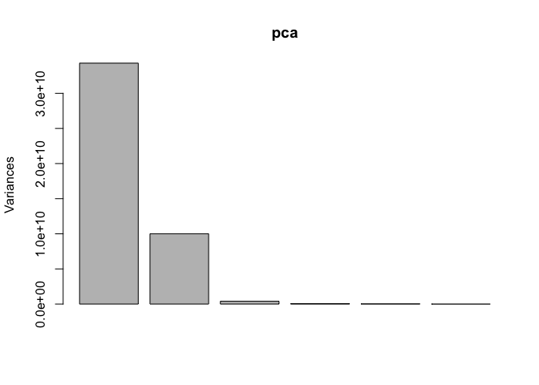
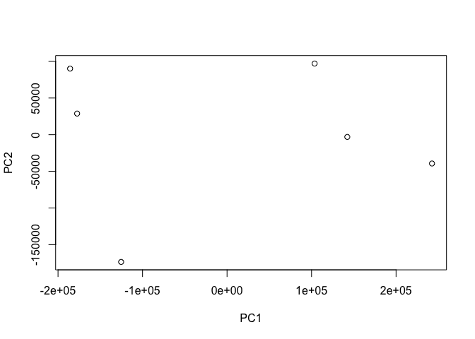
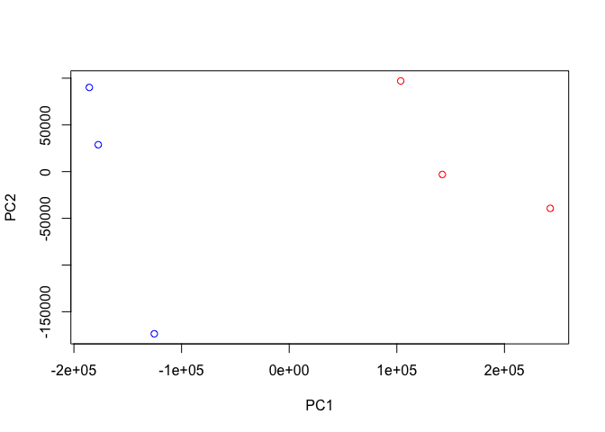
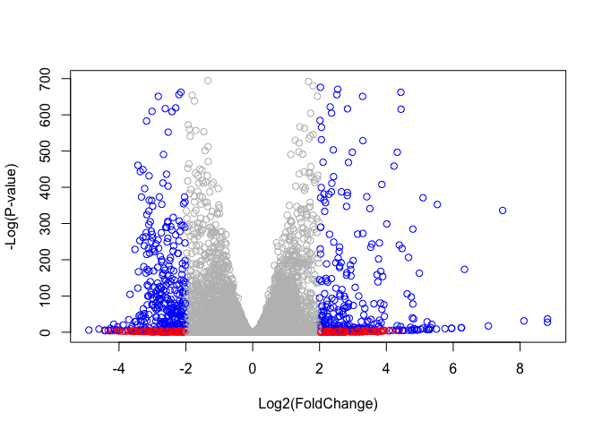

Lecture 15
================

## Pathway Analysis from RNA-Seq Results

``` r
library(DESeq2)
```

    ## Loading required package: S4Vectors

    ## Loading required package: stats4

    ## Loading required package: BiocGenerics

    ## Loading required package: parallel

    ## 
    ## Attaching package: 'BiocGenerics'

    ## The following objects are masked from 'package:parallel':
    ## 
    ##     clusterApply, clusterApplyLB, clusterCall, clusterEvalQ,
    ##     clusterExport, clusterMap, parApply, parCapply, parLapply,
    ##     parLapplyLB, parRapply, parSapply, parSapplyLB

    ## The following objects are masked from 'package:stats':
    ## 
    ##     IQR, mad, sd, var, xtabs

    ## The following objects are masked from 'package:base':
    ## 
    ##     anyDuplicated, append, as.data.frame, basename, cbind,
    ##     colnames, dirname, do.call, duplicated, eval, evalq, Filter,
    ##     Find, get, grep, grepl, intersect, is.unsorted, lapply, Map,
    ##     mapply, match, mget, order, paste, pmax, pmax.int, pmin,
    ##     pmin.int, Position, rank, rbind, Reduce, rownames, sapply,
    ##     setdiff, sort, table, tapply, union, unique, unsplit, which,
    ##     which.max, which.min

    ## 
    ## Attaching package: 'S4Vectors'

    ## The following object is masked from 'package:base':
    ## 
    ##     expand.grid

    ## Loading required package: IRanges

    ## Loading required package: GenomicRanges

    ## Loading required package: GenomeInfoDb

    ## Loading required package: SummarizedExperiment

    ## Loading required package: Biobase

    ## Welcome to Bioconductor
    ## 
    ##     Vignettes contain introductory material; view with
    ##     'browseVignettes()'. To cite Bioconductor, see
    ##     'citation("Biobase")', and for packages 'citation("pkgname")'.

    ## Loading required package: DelayedArray

    ## Loading required package: matrixStats

    ## 
    ## Attaching package: 'matrixStats'

    ## The following objects are masked from 'package:Biobase':
    ## 
    ##     anyMissing, rowMedians

    ## Loading required package: BiocParallel

    ## 
    ## Attaching package: 'DelayedArray'

    ## The following objects are masked from 'package:matrixStats':
    ## 
    ##     colMaxs, colMins, colRanges, rowMaxs, rowMins, rowRanges

    ## The following objects are masked from 'package:base':
    ## 
    ##     aperm, apply, rowsum

### Data Bookkeeping

Load our data

``` r
metaFile <- "GSE37704_metadata.csv"
countFile <- "GSE37704_featurecounts.csv"
```

``` r
colData = read.csv(metaFile, row.names=1)
head(colData)
```

    ##               condition
    ## SRR493366 control_sirna
    ## SRR493367 control_sirna
    ## SRR493368 control_sirna
    ## SRR493369      hoxa1_kd
    ## SRR493370      hoxa1_kd
    ## SRR493371      hoxa1_kd

``` r
countData = read.csv(countFile, row.names=1)
head(countData)
```

    ##                 length SRR493366 SRR493367 SRR493368 SRR493369 SRR493370
    ## ENSG00000186092    918         0         0         0         0         0
    ## ENSG00000279928    718         0         0         0         0         0
    ## ENSG00000279457   1982        23        28        29        29        28
    ## ENSG00000278566    939         0         0         0         0         0
    ## ENSG00000273547    939         0         0         0         0         0
    ## ENSG00000187634   3214       124       123       205       207       212
    ##                 SRR493371
    ## ENSG00000186092         0
    ## ENSG00000279928         0
    ## ENSG00000279457        46
    ## ENSG00000278566         0
    ## ENSG00000273547         0
    ## ENSG00000187634       258

Remove first column named length to make CountData rows match MetaData
columns

``` r
countData <- as.matrix(countData[,-1])
head(countData)
```

    ##                 SRR493366 SRR493367 SRR493368 SRR493369 SRR493370
    ## ENSG00000186092         0         0         0         0         0
    ## ENSG00000279928         0         0         0         0         0
    ## ENSG00000279457        23        28        29        29        28
    ## ENSG00000278566         0         0         0         0         0
    ## ENSG00000273547         0         0         0         0         0
    ## ENSG00000187634       124       123       205       207       212
    ##                 SRR493371
    ## ENSG00000186092         0
    ## ENSG00000279928         0
    ## ENSG00000279457        46
    ## ENSG00000278566         0
    ## ENSG00000273547         0
    ## ENSG00000187634       258

Complete the code below to filter countData to exclude genes (i.e. rows)
where we have 0 read count across all samples (i.e. columns).

``` r
countData1 <- countData[rowSums(countData) > 0, ]
```

How many genes are we left with?

``` r
nrow(countData1)
```

    ## [1] 15975

### PCA Analysis

The first analysis step is usually always to plot the data but here we
have 15k genes. How do we plot this? PCA\!

``` r
pca <- prcomp(t(countData1))
plot(pca)
```

<!-- -->

How well does PC analysis capture the data? Well\! Most in PC1

``` r
summary(pca)
```

    ## Importance of components:
    ##                              PC1       PC2       PC3       PC4      PC5
    ## Standard deviation     1.852e+05 1.001e+05 1.998e+04 6.886e+03 5.15e+03
    ## Proportion of Variance 7.659e-01 2.235e-01 8.920e-03 1.060e-03 5.90e-04
    ## Cumulative Proportion  7.659e-01 9.894e-01 9.983e-01 9.994e-01 1.00e+00
    ##                              PC6
    ## Standard deviation     9.558e-10
    ## Proportion of Variance 0.000e+00
    ## Cumulative Proportion  1.000e+00

Make plot PC1 vs PC2

``` r
plot(pca$x[,1:2])
```

<!-- -->

How do we know which experiments are which? Make a color vector and
color it. Blue is control, red is knockout

``` r
mycols <- c(rep("blue",3), rep("red",3) )
mycols
```

    ## [1] "blue" "blue" "blue" "red"  "red"  "red"

``` r
plot(pca$x[,1:2] , col = mycols)
```

<!-- -->

### DESeq Analysis

``` r
library(DESeq2)
```

``` r
dds = DESeqDataSetFromMatrix(countData=countData1,
                             colData=colData,
                             design=~condition)
##design parameter comes from ColData, signifies the column that contains the condition that youre working with 
dds = DESeq(dds)
```

    ## estimating size factors

    ## estimating dispersions

    ## gene-wise dispersion estimates

    ## mean-dispersion relationship

    ## final dispersion estimates

    ## fitting model and testing

``` r
dds
```

    ## class: DESeqDataSet 
    ## dim: 15975 6 
    ## metadata(1): version
    ## assays(4): counts mu H cooks
    ## rownames(15975): ENSG00000279457 ENSG00000187634 ...
    ##   ENSG00000276345 ENSG00000271254
    ## rowData names(22): baseMean baseVar ... deviance maxCooks
    ## colnames(6): SRR493366 SRR493367 ... SRR493370 SRR493371
    ## colData names(2): condition sizeFactor

``` r
res <- results(dds)
res
```

    ## log2 fold change (MLE): condition hoxa1 kd vs control sirna 
    ## Wald test p-value: condition hoxa1 kd vs control sirna 
    ## DataFrame with 15975 rows and 6 columns
    ##                         baseMean     log2FoldChange              lfcSE
    ##                        <numeric>          <numeric>          <numeric>
    ## ENSG00000279457 29.9135794276176  0.179257083672691  0.324821565250144
    ## ENSG00000187634 183.229649921658  0.426457118403307  0.140265820376891
    ## ENSG00000188976 1651.18807619944 -0.692720464846367 0.0548465415913881
    ## ENSG00000187961 209.637938486147  0.729755610585227  0.131859899969346
    ## ENSG00000187583 47.2551232589398 0.0405765278756319  0.271892808601774
    ## ...                          ...                ...                ...
    ## ENSG00000273748 35.3026523877463  0.674387102558604  0.303666187454138
    ## ENSG00000278817 2.42302393023632 -0.388988266500022   1.13039377720312
    ## ENSG00000278384 1.10179649846993  0.332990658240633    1.6602614216556
    ## ENSG00000276345 73.6449563127136 -0.356180759105171  0.207715658398249
    ## ENSG00000271254 181.595902546813 -0.609666545167282   0.14132048280351
    ##                               stat               pvalue
    ##                          <numeric>            <numeric>
    ## ENSG00000279457  0.551863246932653    0.581042050747029
    ## ENSG00000187634   3.04034951107424  0.00236303749730971
    ## ENSG00000188976  -12.6301576133496 1.43989540153787e-36
    ## ENSG00000187961   5.53432552849561 3.12428248077716e-08
    ## ENSG00000187583   0.14923722361139    0.881366448669145
    ## ...                            ...                  ...
    ## ENSG00000273748   2.22081723425482   0.0263633428047818
    ## ENSG00000278817 -0.344117487502873    0.730757932009184
    ## ENSG00000278384  0.200565196478864    0.841038574220432
    ## ENSG00000276345  -1.71475160732598   0.0863907773559442
    ## ENSG00000271254  -4.31407063627822 1.60275699407023e-05
    ##                                 padj
    ##                            <numeric>
    ## ENSG00000279457    0.686554777832896
    ## ENSG00000187634  0.00515718149494307
    ## ENSG00000188976 1.76548905389893e-35
    ## ENSG00000187961  1.1341299310762e-07
    ## ENSG00000187583    0.919030615571379
    ## ...                              ...
    ## ENSG00000273748   0.0479091179108353
    ## ENSG00000278817    0.809772069001613
    ## ENSG00000278384    0.892653531513564
    ## ENSG00000276345    0.139761501281219
    ## ENSG00000271254 4.53647639304918e-05

Volcano plot summary

``` r
plot( res$log2FoldChange, -log(res$padj) )
```

<!-- -->

``` r
mycols <- rep("gray", nrow(res) )

mycols[ abs(res$log2FoldChange) > 2 ] <- "red"

inds <- (res$padj < 0.01) & (abs(res$log2FoldChange) > 2 )

mycols[ inds ] <- "blue"
```

``` r
plot( res$log2FoldChange, -log(res$padj), col=mycols , xlab="Log2(FoldChange)", ylab="-Log(P-value)" )
```

<!-- -->

``` r
library("AnnotationDbi")
library("org.Hs.eg.db")
```

    ## 

``` r
columns(org.Hs.eg.db)
```

    ##  [1] "ACCNUM"       "ALIAS"        "ENSEMBL"      "ENSEMBLPROT" 
    ##  [5] "ENSEMBLTRANS" "ENTREZID"     "ENZYME"       "EVIDENCE"    
    ##  [9] "EVIDENCEALL"  "GENENAME"     "GO"           "GOALL"       
    ## [13] "IPI"          "MAP"          "OMIM"         "ONTOLOGY"    
    ## [17] "ONTOLOGYALL"  "PATH"         "PFAM"         "PMID"        
    ## [21] "PROSITE"      "REFSEQ"       "SYMBOL"       "UCSCKG"      
    ## [25] "UNIGENE"      "UNIPROT"

``` r
res$symbol = mapIds(org.Hs.eg.db,
                    keys=row.names(res), # where are your gene ids? they are the row names
                    keytype="ENSEMBL", # what format are your ids currently?
                    column="SYMBOL", # what do you want to map it to? what NEW ids format do                                          you want?
                    multiVals="first") # if there are things that are crosslisted, which one                                              do you want it to take?
```

    ## 'select()' returned 1:many mapping between keys and columns

``` r
res$entrez = mapIds(org.Hs.eg.db,
                    keys=row.names(res),
                    keytype="ENSEMBL",
                    column="ENTREZID",
                    multiVals="first")
```

    ## 'select()' returned 1:many mapping between keys and columns

``` r
res$gene.name =   mapIds(org.Hs.eg.db,
                    keys=row.names(res),
                    keytype="ENSEMBL",
                    column="GENENAME",
                    multiVals="first")
```

    ## 'select()' returned 1:many mapping between keys and columns

``` r
head(res, 10)
```

    ## log2 fold change (MLE): condition hoxa1 kd vs control sirna 
    ## Wald test p-value: condition hoxa1 kd vs control sirna 
    ## DataFrame with 10 rows and 9 columns
    ##                          baseMean     log2FoldChange              lfcSE
    ##                         <numeric>          <numeric>          <numeric>
    ## ENSG00000279457  29.9135794276176  0.179257083672691  0.324821565250144
    ## ENSG00000187634  183.229649921658  0.426457118403307  0.140265820376891
    ## ENSG00000188976  1651.18807619944 -0.692720464846367 0.0548465415913881
    ## ENSG00000187961  209.637938486147  0.729755610585227  0.131859899969346
    ## ENSG00000187583  47.2551232589398 0.0405765278756319  0.271892808601774
    ## ENSG00000187642  11.9797501642461  0.542810491577361  0.521559849534146
    ## ENSG00000188290  108.922127976716    2.0570638345631  0.196905312993835
    ## ENSG00000187608   350.71686801731  0.257383686481772  0.102726560033547
    ## ENSG00000188157    9128.439421961  0.389908792022771 0.0467163395511497
    ## ENSG00000237330 0.158192358990472  0.785955208142751    4.0804728567969
    ##                              stat               pvalue
    ##                         <numeric>            <numeric>
    ## ENSG00000279457 0.551863246932653    0.581042050747029
    ## ENSG00000187634  3.04034951107424  0.00236303749730971
    ## ENSG00000188976 -12.6301576133496 1.43989540153787e-36
    ## ENSG00000187961  5.53432552849561 3.12428248077716e-08
    ## ENSG00000187583  0.14923722361139    0.881366448669145
    ## ENSG00000187642  1.04074439790984    0.297994191720984
    ## ENSG00000188290   10.446969679419   1.512818754073e-25
    ## ENSG00000187608  2.50552229528292     0.01222706894099
    ## ENSG00000188157  8.34630443585718  7.0432114877135e-17
    ## ENSG00000237330 0.192613757210411    0.847261469988086
    ##                                 padj      symbol      entrez
    ##                            <numeric> <character> <character>
    ## ENSG00000279457    0.686554777832896          NA          NA
    ## ENSG00000187634  0.00515718149494307      SAMD11      148398
    ## ENSG00000188976 1.76548905389893e-35       NOC2L       26155
    ## ENSG00000187961  1.1341299310762e-07      KLHL17      339451
    ## ENSG00000187583    0.919030615571379     PLEKHN1       84069
    ## ENSG00000187642    0.403379309754101       PERM1       84808
    ## ENSG00000188290 1.30538189681077e-24        HES4       57801
    ## ENSG00000187608   0.0237452288908038       ISG15        9636
    ## ENSG00000188157 4.21962808560657e-16        AGRN      375790
    ## ENSG00000237330                   NA      RNF223      401934
    ##                                                                gene.name
    ##                                                              <character>
    ## ENSG00000279457                                                       NA
    ## ENSG00000187634                 sterile alpha motif domain containing 11
    ## ENSG00000188976 NOC2 like nucleolar associated transcriptional repressor
    ## ENSG00000187961                              kelch like family member 17
    ## ENSG00000187583                 pleckstrin homology domain containing N1
    ## ENSG00000187642             PPARGC1 and ESRR induced regulator, muscle 1
    ## ENSG00000188290                   hes family bHLH transcription factor 4
    ## ENSG00000187608                            ISG15 ubiquitin like modifier
    ## ENSG00000188157                                                    agrin
    ## ENSG00000237330                                  ring finger protein 223

``` r
res = res[order(res$pvalue),]
write.csv(res, file="deseq_results.csv")
```

### Pathway Analysis

``` r
BiocManager::install( c("pathview", "gage", "gageData") )
```

    ## Bioconductor version 3.10 (BiocManager 1.30.9), R 3.6.1 (2019-07-05)

    ## Installing package(s) 'pathview', 'gage', 'gageData'

    ## 
    ## The downloaded binary packages are in
    ##  /var/folders/fj/z_kfjy2n72dfpm1q2264_nfm0000gn/T//RtmpopevpB/downloaded_packages

    ## installing the source package 'gageData'

    ## Old packages: 'boot', 'digest', 'foreign', 'KernSmooth', 'knitr', 'mgcv',
    ##   'nlme', 'Rcpp', 'rlang', 'rmarkdown', 'survival', 'tinytex', 'xfun'

``` r
library(pathview)
```

    ## ##############################################################################
    ## Pathview is an open source software package distributed under GNU General
    ## Public License version 3 (GPLv3). Details of GPLv3 is available at
    ## http://www.gnu.org/licenses/gpl-3.0.html. Particullary, users are required to
    ## formally cite the original Pathview paper (not just mention it) in publications
    ## or products. For details, do citation("pathview") within R.
    ## 
    ## The pathview downloads and uses KEGG data. Non-academic uses may require a KEGG
    ## license agreement (details at http://www.kegg.jp/kegg/legal.html).
    ## ##############################################################################

``` r
library(gage)
library(gageData)
```

``` r
data(kegg.sets.hs)
data(sigmet.idx.hs)

kegg.sets.hs = kegg.sets.hs[sigmet.idx.hs]
```

The main gage() function requres a named vector of fold changes, where
the names of the values are the Entrez gene IDs.

Not that we used the mapIDs() function above to obtain Entrez gene IDs
(stored in `res$extrez` and we have the fold cha)

``` r
foldchanges = res$log2FoldChange
names(foldchanges) = res$entrez
```

Now lets run the gage() function

``` r
# Get the results
keggres = gage(foldchanges, gsets = kegg.sets.hs)
```

``` r
attributes(keggres)
```

    ## $names
    ## [1] "greater" "less"    "stats"

``` r
pathview(gene.data=foldchanges, pathway.id="hsa04110")
```

    ## 'select()' returned 1:1 mapping between keys and columns

    ## Info: Working in directory /Users/reinaangelicabassil/Documents/UCSD Biology PhD/BGGN213_Bioinformatics/Learning_R_Lecture10/BGGN213_github/Learning_R_Lecture15

    ## Info: Writing image file hsa04110.pathview.png

To view in R Markdown


