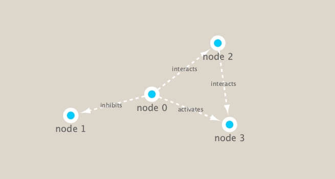

```{r setup, include=FALSE}
knitr::opts_chunk$set(echo = TRUE)
```


```{r}
library(RCy3)
library(igraph)
library(RColorBrewer)
```

Test connection to Cytoscape!

```{r}
cytoscapePing()
```

We can test things further by making a small network (here in igraph format as used by the R igraph package) and sending it to Cytoscape:

```{r}
g <- makeSimpleIgraph()
createNetworkFromIgraph(g,"myGraph")
```


We can include this Cytoscape rendered network image in our report with the following code:

```{r}
fig <- exportImage(filename="demo", type="png", height=350)
```


```{r}
knitr::include_graphics("./demo.png")
```


### Switch Styles

Cytoscape provides a number of canned visual styles. The code below explores some of these styles. For example check out the marquee style! 


```{r}
setVisualStyle("Marquee")
```


```{r}
fig <- exportImage(filename="demo_marquee", type="png", height=350)


```

What other styles are available?
```{r}
styles <- getVisualStyleNames()
styles
```


```{r}
plot(g)
```


```{r eval=FALSE, include=FALSE}
prok_vir_cor <- read.delim("data/virus_prok_cor_abundant.tsv", stringsAsFactors = FALSE)
```


